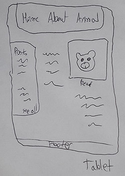
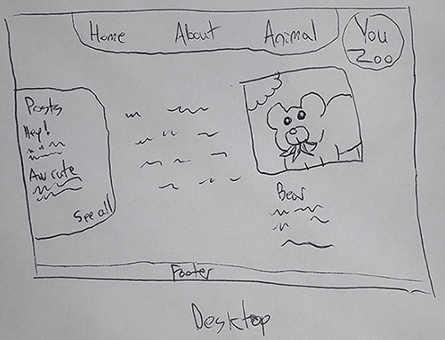

# Per Scholas Capstone Project
 

  

## Description

YouZoo was designed with relaxing in mind. The goal is for the user to have a pleasant, cerebral experience at a virtual zoo, with the ability to write posts.

View the application live [here.](https://youzoo.netlify.app/)

### MVP

Users should be able to get a random animal with a button click, and be able to post/leave comments on the website. Users can read, post, edit, and delete comments. The website should be pleasing to look at.

###  POST-MVP

In the future, users should be able to leave comments on the specific animals. Also, users should be able to authenticate themselves so that when an individual posts a comment, only they can edit or delete it.

## Features

- **Zoo Animal**
  - Get a random zoo animal image and information, such as habitat
- **Next Exhibit button**
  - Returns a new animal
- **Create Post**
  - Leave a comment in the Posts section
- **Edit Post**
  - Revise your post
- **Delete Post**
  - Terminate your post forever

## APIs

### <b><a href="https://zoo-animal-api.herokuapp.com">Zoo Animal API</a></b>

This API was used to pull a random animal image and information

***Endpoints Used***\
 
`/animals/rand`  
- Returns a single random animal

### <b><a href="https://youzoo-posts.herokuapp.com/api">YouZoo Posts API</a></b>

This API was created by myself for the sole purpose of providing the Post database and functions

***Endpoints Used***\
 
`/posts`
- Get All Posts
- Create Post

`/posts/:id`
- Get Post by ID
- Update Post
- Delete Post

## Wireframes

  